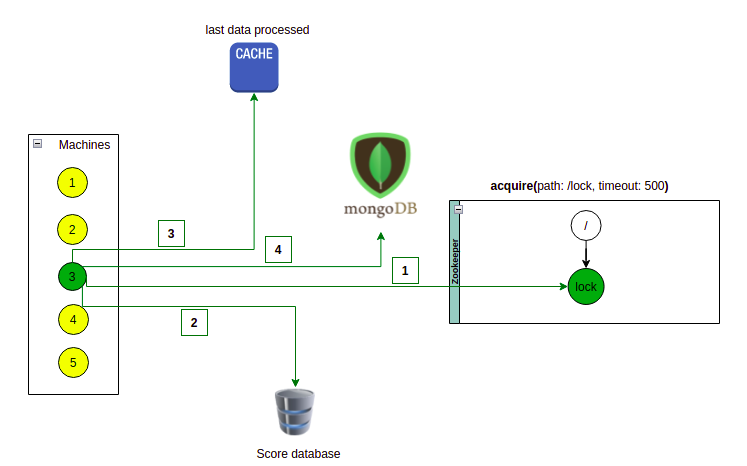

### Zab (Zookeeper Atomic Broadcast) 

#### Distributed lock example implemented with Zookeeper  

 

 The goal is to get the data from the score database and import it to MongoDB. With multiple machines competing for the same
data, the lock with Zookeeper will allow only one machine at a time to execute the import process. The next machine will continue
where the last one left off until finished the import.

 1. When the machine runs the import it has to get the lock in Zookeeper
 2. With the lock acquired the machine 3 get the data(from id 1 to id 100) from the score database
    1. The score database has a table with users with ids from 1 to 1000
    2. With multiple machines, they cannot compete with each other to not import repeated data

 3. The machine 3 stores the id 100 in the cache for the next machine that manages to get the lock to continue the import
from that id.
 4. The machine 3 release the lock and initialize the process to store the data in the MongoDB

 